# 통계학 2주차 정규과제

📌통계학 정규과제는 매주 정해진 분량의 『*데이터 분석가가 반드시 알아야 할 모든 것*』 을 읽고 학습하는 것입니다. 이번 주는 아래의 **Statistics_2nd_TIL**에 나열된 분량을 읽고 `학습 목표`에 맞게 공부하시면 됩니다.

아래의 문제를 풀어보며 학습 내용을 점검하세요. 문제를 해결하는 과정에서 개념을 스스로 정리하고, 필요한 경우 추가자료와 교재를 다시 참고하여 보완하는 것이 좋습니다.

2주차는 `1부. 데이터 기초체력 기르기`를 읽고 새롭게 배운 내용을 정리해주시면 됩니다.


## Statistics_2nd_TIL

### 1부. 데이터 기초체력 기르기
### 06. 확률분포
### 07. 가설검정

## Study Schedule

|주차 | 공부 범위     | 완료 여부 |
|----|----------------|----------|
|1주차| 1부 p.2~56     | ✅      |
|2주차| 1부 p.57~79    | ✅      | 
|3주차| 2부 p.82~120   | 🍽️      | 
|4주차| 2부 p.121~202  | 🍽️      | 
|5주차| 2부 p.203~254  | 🍽️      | 
|6주차| 3부 p.300~356  | 🍽️      | 
|7주차| 3부 p.357~615  | 🍽️      |

<!-- 여기까진 그대로 둬 주세요-->

# 06. 확률분포

```
✅ 학습 목표 :
* 이산확률분포의 종류와 특징을 설명할 수 있다.
* 연속확률분포의 종류와 특징을 설명할 수 있다. 
* 중심극한정리(CLT)의 개념을 이해하고 설명 할 수 있다.
```

## 6.2. 이산확률분포

> **🧚 이산확률분포에 대해 학습한 내용을 정리해주세요.**

<!--수식과 공식을 암기하기보다는 분포의 개념과 특성을 위주로 공부해주세요. 분석 대상의 데이터가 어떠한 확률분포의 특성을 가지고 있는지를 아는 것이 더 중요합니다.-->


### *️⃣ 이산확률분포
이산확률 변수의 확률분포, 실수와 같이 명확한 값을 갖는 분포

1. 균등분포 <br/>
X가 동일한 확률을 가지는 분포

2. 이항분포 <br/>
1과 0의 값만 갖는 분포

‼️ 베르누이 시행 : 결과가 두 가지 중 하나만 나오는 시행으로, 시행 1번의 결과가 성공(특정 사건 발생) OR 실패(특정 사건 발생X)! 각각의 결과가 독립적으로 시행 <br/>
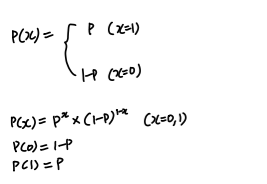 <br/>
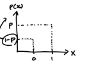
<br/>

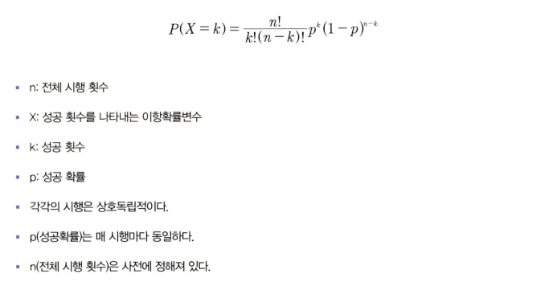 <br/>
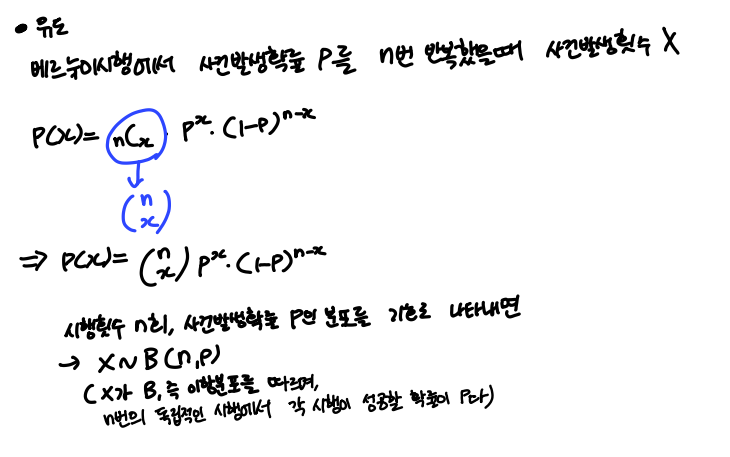
<br/>
<br/>

### *️⃣ 초기하분포 <br/>
이항분포와 달리, **각 시행이 서로 독립적이지 않아 시행마다 성공할 확률이 달라짐** <br/>
(복원 추출인 이항분포와 달리 초기하는 비복원 추출이므로) 
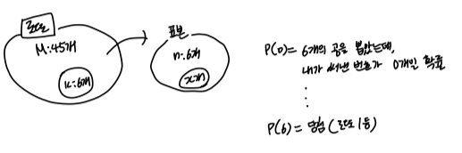


### *️⃣ 포아송분포
- **일정한 시공간** 안에서 발생하는 사건의 횟수
    - 이항분포에서 유도된 분포로, 시행횟수 n이 무수히 커지고 발생확률 p가 아주 작아진 경우에 유도
    - 그렇다고 확률과 시행횟수가 없는건 아닌데 정의하기 어렵다!
    - 성공(1)과 실패(0)의 개념이 존재 x, 표본의 크기라는 개념이 존재 x<br/>
    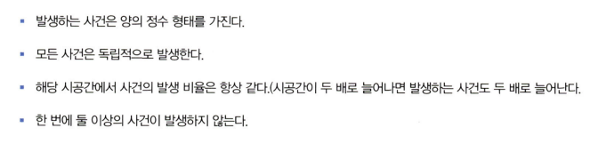
<br/>
<br/>

- 예시
    - 공장에서 기계가 고장나는 횟수
    - 콜센터에 1시간동안 전화 오는 횟수
    - 새로운 교통사고 보험 상품을 출시하기 위해 사람들이 특정 연령대 구간에서 평균적으로 몇 번의 교통사고를 당하는지<br/>
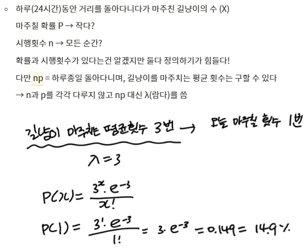
<br/>
<br/>

- 공식 <br/>
np(이항분포의 평균) 대신 람다(λ)를 **일정 시공간에서의 평균 사건 발생 횟수**로 씀
<br/>
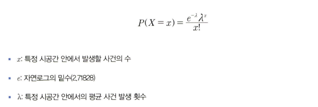


## 6.3. 연속확률분포

> **🧚 연속확률분포에 대해 학습한 내용을 정리해주세요.**

<!--수식과 공식을 암기하기보다는 분포의 개념과 특성을 위주로 공부해주세요. 분석 대상의 데이터가 어떠한 확률분포의 특성을 가지고 있는지를 아는 것이 더 중요합니다.-->

- 개념
    - 연속적인 공간 안에 확률변수가 가질 수 있는 값이 무한히 많음 -> 특정한 값을 가질 확률이 0으로 수렴
    - **확률변수 X가 특정 구간에 속할 확률**을 구해야함! 

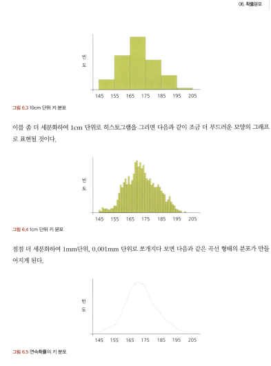<br/>
➡️ 전체 분포에서 특정 구간인 a에서 b의 사건이 발생할 수 있는 확률을 구하기 위해 '확률밀도함수(PDF)'를 이용<br/>
💡 이산확률분포는 특정 값을 가질 확률을 구할 수 있으므로 확률질량함수를 쓰지만, **연속형 확률분포**는 **'확률밀도함수'**를 통해 **전체 분포 중 특정 면적을 적분으로 분리해 면적 구간 안에서 사건이 발생할 확률**을 계산
<br/>
<br/>

### *️⃣ 6.3.1. 정규분포
- 대표적인 연속확률분포
- 충족 조건
    1. 평균을 중심으로 좌우 대칭의 종 모양 -> 평균, 중앙값, 최빈값이 같음
    2. 평균을 기준으로 좌우로 1 표준편차 안에 68.26%의 확률변숫값이 포함됨

- 방법
    - 그래프의 면적을 계산해 확률 구함
    - 정규분포를 일괄적인 기준으로 '표준화'시켜야함
        - 각기 다른 정규분포 간 비교의 동질성을 위해 **평균이 0, 분산이 1**인 표준정규분포로 형태 바꿔줌!
<br/>
<br/>

### *️⃣ 6.3.2. 지수분포
- 특정 사건이 발생한 시점으로부터 **다음 사건이 발생할 때까지의 시간**을 확률변수값으로 하는 분포
    - 포아송분포: 특정 사건이 발생하는 횟수를 나타내는 변수
    vs
    - 지수분포: 발생하는 사건 다음 사건이 일어날 때까지 대기 시간 (시간도 무한히 쪼갤 수 있으니 연속확률분포)

- 예시
    - 가전업체의 A/S센터에 전화가 걸려온 후 다음 전화가 걸려올 때까지의 시간에 대한 확률변수

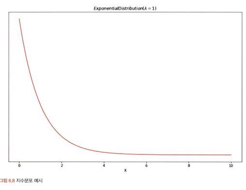<br/>
-> 확률변수 X가 시간이 증가할수록 사건이 발생할 확률이 지수적으로 감소

- 이처럼 지수분포는 표준정규분포처럼 절대적 기준 x, 평균에 따라 기울기 결정
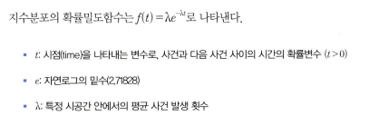
<br/>
<br/>


## 6.4. 중심극한정리

> **🧚 중심극한정리에 대해 학습한 내용을 정리해주세요.**

🤔 표본의 평균, 표준편차 등은 모집단과 완벽히 동일할 수 없음. 그럼 표본의 통계치를 통해 어떻게 모집단을 추정할 수 있을까? 

### 🌟 중심극한정리
- 데이터의 크기(n)가 일정한 양(일반적으로 30)을 넘으면, **평균의 분포**는 정규분포에 근사한다

-> 모집단의 분포가 어떤 형태인지 모르더라도, 표본을 충분히 추출하면 표본 평균들의 분포가 정규분포를 이루므로 통계적 추정이 가능해짐

# 07. 가설검정

```
✅ 학습 목표 :
* 귀무가설과 대립가설의 개념을 정의하고, 주어진 연구 질문에 적절한 가설을 설정할 수 있다.
* 가설검정의 유의수준과 p값의 개념을 설명하고, p값을 해석하여 귀무가설을 기각할지 여부를 판단할 수 있다.
* 1종 오류와 2종 오류의 차이를 설명하고, 실제 사례에서 어떤 오류를 더 중요하게 고려해야 하는지 판별할 수 있다.
```

<!-- 새롭게 배운 내용을 자유롭게 정리해주세요.-->
### *️⃣ 귀무가설과 대립가설
- 통계량을 사용하여 검정(추론통계)하려면 검정 주제가 필요함.<br/>
검정 주제가 바로 '가설'!
- 둘 혹은 그 이상의 변수들 간의 관계에 대한 잠정적 결론 = 가설

- 개념
    - 귀무가설(H0): 새로이 증명하고자 하는 가설과 반대되는 가설 (집단 간 차이가 없거나 변수의 영향력이 없는 상태)
    - 대립가설(H1): 귀무가설이 기각됐을 때 대안적으로 채택되는 가설


- 절차

1. 가설 설정 (차이가 있다/없다, 영향력이 있다/없다, 연관성이 있다/없다)
2. 귀무가설을 기각하거나 채택하기 위한 기준 '유의수준'(일반적으로 0.05) 설정
    - 유의수준이 0.05이다 = 표본의 통계치가 귀무가설과 같이 나올 확률이 5% 미만이다
3. 통계 모델로 실험 수행
    - 집단 간의 평균 차이 검정 : t-test, ANOVA
    - 종속변수에 대한 독립변수의 영향력 검정 : 회귀모델 <br/>
    -> 이와 같은 유의확률이 산출됐을 시, 앞서 설정한 유의 수준을 통과하는지 확인
4. 귀무가설 채택 or 기각

[STA15](./image/STA15.png)
<br/>

- 귀무가설의 기각역 방향 설정 
    - 왼쪽꼬리 검정
    - 오른쪽꼬리 검정
    - 양측 검정
    -> 되도록이면 양측검정보다는 단측 검정이 바람직! <br/>
    통계량이 같지 않다는 것만 알 수 있는 양측검정보다는 크거나 작은 방향성에 대한 정보가 포함되므로


### *️⃣ 1종 오류, 2종 오류
- 1종 오류: 귀무가설이 참임에도 불구하고 귀무가설을 기각하는 오류 (실제로 효과가 없는데 있다고 판단)
- 2종 오류: 귀무가설이 거짓임에도 불구하고 귀무가설을 채택하는 오류 (실제로 효과가 있는데 없다고 판단)

<br>
<br>

# 확인 문제

## 문제 1.

> **🧚Q. 다음 중 귀무가설(H₀)을 기각해야 하는 경우는 언제인가요? 정답을 고르고, 그 이유를 간단히 설명해주세요.**

> **1️⃣ 유의수준(α)이 0.05이고, p값이 0.03일 때   
2️⃣ 유의수준(α)이 0.01이고, p값이 0.02일 때**

```
여기에 답을 작성해주세요!
```

### 🎉 수고하셨습니다.