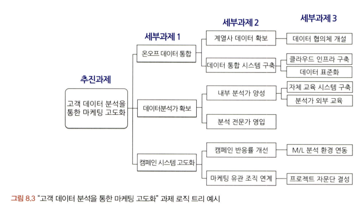
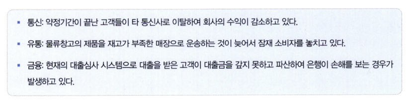
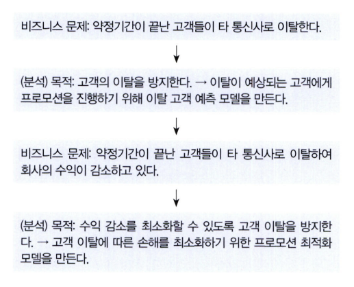
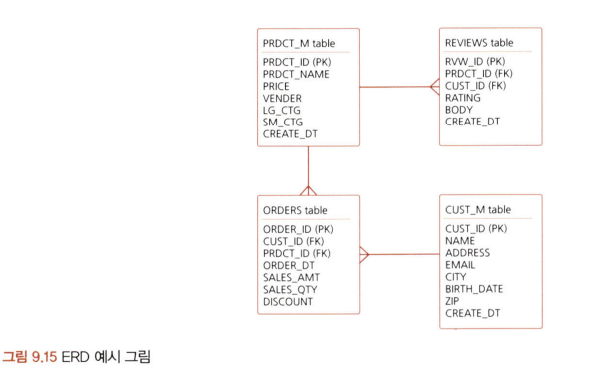
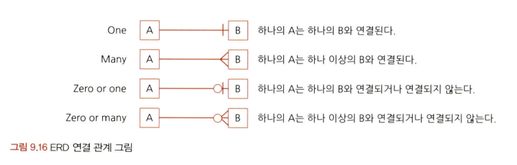

# 통계학 3주차 정규과제

📌통계학 정규과제는 매주 정해진 분량의 『*데이터 분석가가 반드시 알아야 할 모든 것*』 을 읽고 학습하는 것입니다. 이번 주는 아래의 **Statistics_3rd_TIL**에 나열된 분량을 읽고 `학습 목표`에 맞게 공부하시면 됩니다.

아래의 문제를 풀어보며 학습 내용을 점검하세요. 문제를 해결하는 과정에서 개념을 스스로 정리하고, 필요한 경우 추가자료와 교재를 다시 참고하여 보완하는 것이 좋습니다.

2주차는 `2부-데이터 분석 준비하기`를 읽고 새롭게 배운 내용을 정리해주시면 됩니다.


## Statistics_3rd_TIL

### 2부. 데이터 분석 준비하기
### 08. 분석 프로젝트 준비 및 기획
### 09. 분석 환경 세팅하기


## Study Schedule

|주차 | 공부 범위     | 완료 여부 |
|----|----------------|----------|
|1주차| 1부 p.2~56     | ✅      |
|2주차| 1부 p.57~79    | ✅      | 
|3주차| 2부 p.82~120   | ✅      | 
|4주차| 2부 p.121~202  | 🍽️      | 
|5주차| 2부 p.203~254  | 🍽️      | 
|6주차| 3부 p.300~356  | 🍽️      | 
|7주차| 3부 p.357~615  | 🍽️      |  


<!-- 여기까진 그대로 둬 주세요-->

# 08. 분석 프로젝트 준비 및 기획

```
✅ 학습 목표 :
* 데이터 분석 프로세스를 설명할 수 있다.
* 비즈니스 문제를 정의할 때 주의할 점을 설명할 수 있다.
* 외부 데이터를 수집하는 방법에 대해 인식한다.
```
<br/>
<br/>

### *️⃣ 데이터 분석의 궁극적인 목표
- 의사결정 프로세스 최적화, 즉 효과적인 결정을 할 수 있도록 도움을 주는 것 
<br/>
<br/>

### *️⃣ 데이터 분석 3단계
1. 설계
2. 분석 및 모델링
3. 구축 및 활용
<br/>
<br/>

### *️⃣ 비즈니스 문제 정의
- 논리적 접근법 MECE
   - 세부 정의들이 서로 겹치지 않고 전체를 합쳤을 때는 빠진 것 없이 완전히 전체를 이루는 것

   - HOW?
      - 일반적으로 로직 트리(Logic Tree)로 세부 항목을 정리함
      - 이때 **세부 항목들은 서로 중복되지 않으면서**, **상위 항목 전체를 포함**하고 있어야함! <br/>
      
<br/>
<br/>

- 잘 정의된 비즈니스 문제란?
   - 비즈니스 문제를 정의할 때, 현상에 대한 설명으로 끝나서는 안됨. 본질적인 문제점이 함께 전달되어야 한다! <br/>
   예시) <br/>
   


   - 비즈니스 문제를 단순한 '고객 이탈'로 시작할 경우 분석 목적은 이탈 고객 예측 모델이 될 것. <br/>
   BUT '고객 이탈에 따른 수익감소'로 시작한다면 이탈에 따른 손해를 최소화할 수 있는 프로모션 최적화 모델을 만드는 것이 목적일 것. <br/>
   🌟 이처럼 **본질적인 문제**를 명시하지 않으면 분석 프로젝트는 본질적인 문제를 해결하지 못하고 끝나버림
<br/>
<br/>

### 주의사항
- 분석 프로젝트 방향은 언제든 바뀔 수 있다! <br/>
데이터를 탐색하기 전까지는 데이터에 숨겨진 정보/인사이트를 파악하기 어려우므로, 바뀌는 일은 자연스럽고 당연하다.<br/>
바뀌는 순간 확실히 인지하고 신속하게 모든 팀원들에게 공유할 것!
<br/>

- **실무자 간의 커뮤니케이션 및 협력!**<br/>
데이터 분석가는 현업자가 아니므로 도메인 지식이 부족한게 당연함. 이때 실무자들 간의 커뮤니케이션 및 협력이 매우 중요하다! 당연한 지식이여도 어렵다 싶으면 반드시 질문하기. 

<br/>
<br/>

### 외부 데이터 수집
- 순서 : 분석 목적을 정한 후 -> 알맞는 외부 데이터를 찾고 수집

- 외부 데이터 수집
   - 정형, 반정형, 비정형 등 다양한 유형의 데이터를 수집하는 것<br/>
   
   <br/>
   1️⃣ 데이터 판매 전문 기업으로부터 데이터 구매, MOU 등을 통해 데이터 공유 <br/>
   2️⃣ 공공 오픈 데이터를 제공하는 사이트에서 엑셀, csv 형태로 데이터 받기 <br/>
   3️⃣ 웹 크롤링 <br/>
   - 원하는 데이터를 실시간으로 자유롭게 수집 가능하지만, 데이터 수집을 위한 프로그래밍이 필요하며 해당 웹페이지가 리뉴얼되면 이에 맞춰 수집 코드도 수정해야 함, 법적인 이슈도 o

### 크롤링링
- 크롤링 : 웹 페이지가 주어지면 그 페이지 내에 있는 링크들을 따라가면서 모든 내용을 다 가져오는 것
- 스크래핑 : 웹 페이지에서 자신이 원하는 부분의 정보만 가져오는 것

- HOW?
   - OPEN API를 통해 정리된 데이터 제공 받음
   - 직접 웹사이트 구조 파악해 원하는 데이터 수집해 오도록 코딩
   - IN 파이썬, BeautifulSoup/Selenium 라이브러리 

- 기본 원리
   - 웹사이트 HTML 구조를 활용해 원하는 데이터가 있는 위치를 사전에 설정하여 자동으로 반복적으로 특정 위치에 있는 텍스트를 수집

<br/>
<br/>
<br/>


# 09. 분석 환경 세팅하기

```
✅ 학습 목표 :
* 데이터 분석의 전체적인 프로세스를 설명할 수 있다.
* 테이블 조인의 개념과 종류를 이해하고, 각 조인 방식의 차이를 구분하여 설명할 수 있다.
* ERD의 개념과 역할을 이해하고, 기본 구성 요소와 관계 유형을 설명할 수 있다.
```
- 데이터 분석 언어
    1. SAS (Statistical Analysis System)
    - 프로그래밍 언어보다는 솔루션에 가까움
    - 데이터 시각화 쉬움, 성능이 확실/지원 잘됨, 정확성 높음 -> but 최근 점유율이 감소중

    2. R
    - 통계적 기능 우수, 데이터 시각화에 특화
    - 오픈소스
    - 파이썬에 비해 상대적으로 프로그래밍적 소양이 부족해도 무리가 없음<br/>
    ------------------------ 데분에 한정된 솔루션/언어


    3. 파이썬
    - C언어로 구현된 프로그래밍 언어
    - 데분뿐만 아니라 다양하게 쓰임
    
    4. SQL
    - 관계형 데이터베이스 시스템에서 데이터를 관리 및 처리하기 위해 설계된 언어

    데이터 전처리의 경우, 주로 SQL + 파이썬 조합
    ML의 경우, 사이킷런 등의 패키지 활용


<br>
<br>

### 데이터 처리 프로세스 (DB 서버 환경)
- 전체적인 흐름<br/>
   : OLTP ➡️ DW(ODS) ➡️ DM ➡️ OLAP <br/>
   
- 1️⃣ OLTP (On-Line Transaction Processing)
   - **실시간으로** 데이터를 **트랜잭션 단위**로 수집, 분류, 저장하는 시스템
   - 데이터가 생성되고 저장되는 첫 단계

- 2️⃣ DW (Data Warehouse)
   - **데이터 창고**! <br/>
   수집된 데이터를 사용자 관점에서 **주제별로 통합**하여 *쉽게 원하는 데이터를 빼낼 수 있도록* 저장해놓은 **통합 DB** (전체 히스토리 데이터 보관)
   - DW를 통해 OLTP를 보호하고 데이터 활용 효율을 높일 수 있음
   - 유사 개념 ODS: DW에 저장하기 전에 임시로 데이터를 보관하는 중간 단계 저장소 (최신 데이터 반영)

- 3️⃣ DM(Data Mart)
   - **사용자의 목적에 맞도록 가공**된 일부 데이터가 저장되는 곳<br/>
   부서별로 필요한 데이터가 서로 다를 것이므로 부서나 사용자 집단의 필요에 맞도록 가공된 개별 데이터 저장소!


- *️⃣ 데이터 처리 프로세스 기본 개념 : ETL
   - 데이터 추출(Extract), 변환(Transform), 불러내기(Load)
   - 저장된 데이터를 사용자가 요구하느 포맷으로 변형하여 이동시키는 작업 과정
<br/>
<br/>

### 테이블 조인
- 보통 적어도 3개 이상의 테이블을 조합, 새로 가공함
- 조인 : 2개 이상의 테이블을 공통의 칼럼 중심으로 결합<br/>
   - inner join, outer join, left join, right join, full join, cross join
<br/>
<br/>

### ERD (Entity Relationship Diagram)
- 각 테이블 구성 정보와 테이블 간 관계를 도식으로 표현한 그림

- 엔티티(Entity)
   - 테이블로 표현 

- ERD에서는 **각 테이블이 어떤 테이블과 어떤 키로 연결되어 있는지** 직관적으로 확인 가능 


- ERD 구분
   - 물리 : DB를 효율적이고 결점 없이 구현하는 것을 목표로 구현하는 ERD
   - 논리 : 데이터 사용자 입장에서 테이블 간 매핍에 오류가 없으며 데이터의 정규화가 이루어진 ERD <BR/>
   ➡️ 데이터 분석가는 논리 ERD를 보고 DB 구조 파악!

- ERD의 핵심, 키와 식별자
   - 키 column: 테이블 간 연결
      - 기본 키(PK): 테이블에 적재된 각각의 데이터를 유일한 식별자!! 엔터티를 대표할 수 있는 키<br/>
      중복 x, 결측값 x
      - 외래 키(FK): 테이블 간의 연결을 위해 다른 테이블의 기본키를 참조하는 키<br/>
      중복/결측값 가능
      - 외래 키가 정의된 테이블 = 자식 테이블<br/>
      참조되는 테이블 = 부모 테이블
   <br/>
   - 식별자: 연결 관계
      - 1:1, 1:N, N:N 등 다양한 연결 관계
      


# 확인 문제

## 문제 1.

> **🧚 아래의 테이블을 조인한 결과를 출력하였습니다. 어떤 조인 방식을 사용했는지 맞춰보세요.**

> 사용한 테이블은 다음과 같습니다.

|
---|---|

> 보기: INNER, LEFT, RIGHT 조인

<!-- 테이블 조인의 종류를 이해하였는지 확인하기 위한 문제입니다. 각 테이블이 어떤 조인 방식을 이용하였을지 고민해보고 각 테이블 아래에 답을 작성해주세요.-->

### 1-1. 

```
LEFT JOIN
```

### 1-2. 

```
INNER JOIN
```

### 1-3. 

```
RIGHT JOIN
```

### 1-4. CROSS JOIN을 수행할 경우, 결과 테이블의 행 개수는 몇 개인가요?

<!--위의 그림과 관계없는 문제입니다. CROSS JOIN을 수행하면 테이블의 행의 개수가 몇 개인지 생각해보세요.-->
```
45개
```

## 문제 2.

> **🧚 다음과 같은 요구사항을 반영한 ERD를 설계할 때 엔터티와 주요 관계를 정의하세요.**

```
[시나리오]  

- 한 회사는 직원(Employee)을 관리하며, 각 직원은 직원 ID, 이름, 부서 ID를 가진다.
- 부서(Department)는 부서 ID, 부서명 속성을 가지며, 여러 직원이 한 부서에 속할 수 있다.
- 프로젝트(Project)는 프로젝트 ID, 프로젝트명을 가지며, 한 직원은 여러 프로젝트에 참여할 수 있다.
- 프로젝트 배정(Project_Assignment) 테이블을 통해 직원과 프로젝트 간의 관계를 관리하며, 배정 ID, 직원 ID(FK), 프로젝트 ID(FK), 배정 날짜를 포함한다. 
```

> **질문:   
1️⃣ 주요 엔터티와 그 속성을 정의하세요.   
2️⃣ 엔터티 간의 관계를 정의하세요.**

```
1️⃣ 엔터티 및 속성
- 직원(Employee): 직원 ID(PK), 이름, 부서 ID(FK)
   - 부서(Department): 부서 ID(PK), 부서명
   - 프로젝트(Project): 프로젝트 ID(PK), 프로젝트명
   - 프로젝트 배정(Project_Assignment): 배정 ID(PK), 직원 ID(FK), 프로젝트 ID(FK), 배정 날짜

2️⃣ 엔터티 간 관계
   - 직원-부서 : N:1 관계 (여러 직원이 하나의 부서에 속함)
   - 직원-프로젝트 : M:N 관계 (한 직원이 여러 프로젝트에 참여할 수 있고, 하나의 프로젝트에도 여러 직원이 배정될 수 있음)
```

### 🎉 수고하셨습니다.