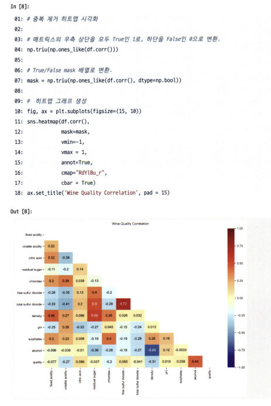

# 통계학 4주차 정규과제

📌통계학 정규과제는 매주 정해진 분량의 『*데이터 분석가가 반드시 알아야 할 모든 것*』 을 읽고 학습하는 것입니다. 이번 주는 아래의 **Statistics_4th_TIL**에 나열된 분량을 읽고 `학습 목표`에 맞게 공부하시면 됩니다.

아래의 문제를 풀어보며 학습 내용을 점검하세요. 문제를 해결하는 과정에서 개념을 스스로 정리하고, 필요한 경우 추가자료와 교재를 다시 참고하여 보완하는 것이 좋습니다.

4주차는 `2부. 데이터 분석 준비하기`를 읽고 새롭게 배운 내용을 정리해주시면 됩니다.


## Statistics_4th_TIL

### 2부. 데이터 분석 준비하기
### 10. 데이터 탐색과 시각화


## Study Schedule

|주차 | 공부 범위     | 완료 여부 |
|----|----------------|----------|
|1주차| 1부 p.2~56     | ✅      |
|2주차| 1부 p.57~79    | ✅      | 
|3주차| 2부 p.82~120   | ✅      | 
|4주차| 2부 p.121~202  | ✅      | 
|5주차| 2부 p.203~254  | 🍽️      | 
|6주차| 3부 p.300~356  | 🍽️      | 
|7주차| 3부 p.357~615  | 🍽️      | 

<!-- 여기까진 그대로 둬 주세요-->

# 10. 데이터 탐색과 시각화

```
✅ 학습 목표 :
* EDA의 목적을 설명할 수 있다.
* 주어진 데이터셋에서 이상치, 누락값, 분포 등을 식별하고 EDA 결과를 바탕으로 데이터셋의 특징을 해석할 수 있다.
* 공분산과 상관계수를 활용하여 두 변수 간의 관계를 해석할 수 있다.
* 적절한 시각화 기법을 선택하여 데이터의 특성을 효과적으로 전달할 수 있다.
```
<!-- 새롭게 배운 내용을 자유롭게 정리해주세요.-->
### EDA vs 데이터 시각화
- EDA: 데이터 파악 단계, 효율적인 방법을 위해 시각화를 하기도 함
- 데이터 시각화: 분석 결과를 공유하고 소통하기 위함

### EDA
- 극단적 해석 피하기, 지나친 추론/자의적 해석 지양
- EDA의 목적


1. 데이터 전반적인 정보 확인
2. 결측치 확인
3. 
- 숫자형 변수 : 기술통계적 측정
- 범주형 변수 : 빈도 등을 확인
4. 왜도/첨도 확인
5. seaborn의 displot()함수로 칼럼 분포 시각화
*0값이 있는 경우, 실제로 0인건지 결측치를 일괄적으로 0으로 입력한 것인지 확인할 필요 있음
6. 변수 간의 관계 파악 
    - 변수 간의 상관관계 
    가정 : 데이터가 등간 or 비율 척도이며, 두 변수가 선형적 관계다.
        - 공분산 : 서로 공유하는 분산, 즉 두 분산의 관계<BR/>
        -> 값으로는 상관성이 얼마나 높은지는 평가하기 힘들지만, **양/음의 상관관계 중 어느 것인지 알 수 있음!**
        - 피어슨 상관계수 : -1 <= R <= 1
            - 공분산 값의 크기가 상관성의 정도를 나타내지 못하므로 피어슨 상관계수 많이 씀
            - 분야마다 차이가 있지만 사회과학은 0.7 이상이면 매우 높음, 0.4 이상이면 어느 정도 상관관계 있다고 봄 
            - 산점도의 기울기와 상관계수는 관련 XX!!
            **상관계수가 높다는 것 = X1이 움직일 때 X2를 예상할 수 있는 정확도(설명력)이 높다** <BR/>
            X1이 움직일 때 X2가 많이 움직인다 (X) <BR/>
    -> 상관분석은 두 변수의 선형관계만 측정 가능하고, 이상치에 민감하므로 상관분석만 하기보다는 산점도 그래프도 함께 그려보는게 좋다! 

    - 중복 제거 히트맵 그리는 방법!!!! 신기하다
        

- 시간 시각화
    - 시간 흐름에 따른 데이터 변화를 ```시계열``` 형태로!
    - 전체적인 흐름, 트렌드, 노이즈 
    1. 선그래프 : 시간 간격의 밀도가 높을 때 (초 단위, 일년 간의 일별 그래프)
    2. 막대그래프, 점 그래프: 밀도 낮을 때 (일년 간의 월별 그래프) 
    <br/>-> 값들의 상대적 차이 나타내기 유리하고 특정 시점에 대한 정보 추가 가능
    <BR/>->누적 막대 그래프: 한 시점에 2개 이상의 세부 항목이 존재할 때
<br>
<br>

# 확인 문제

## 문제 1.
> **🧚 공분산과 상관계수의 차이점에 대해 간단히 설명하세요.**

```
공분산 : 값으로는 상관성이 얼마나 높은지, 상관성의 정도를 평가하기 힘듬. 양/음만 구별 가능
상관계수 : 상관성의 정도를 나타낼 수 있음. 
```

## 문제 2.
> **🧚 다음 데이터 분석 목표에 적합한 시각화 방법을 보기에서 모두 골라 연결해주세요.**

> 보기: 산점도, 선그래프, 막대그래프, 히스토그램, 박스플롯

(a) 변수의 분포 확인   
(b) 두 변수 간의 관계 확인   
(c) 집단별 평균 비교   
(d) 시계열 데이터 분석

<!--중복 가능-->

```
여기에 답을 작성해주세요!
```


### 🎉 수고하셨습니다.