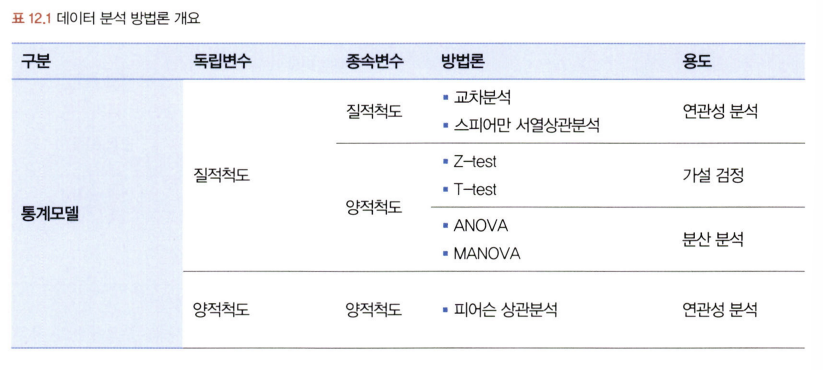
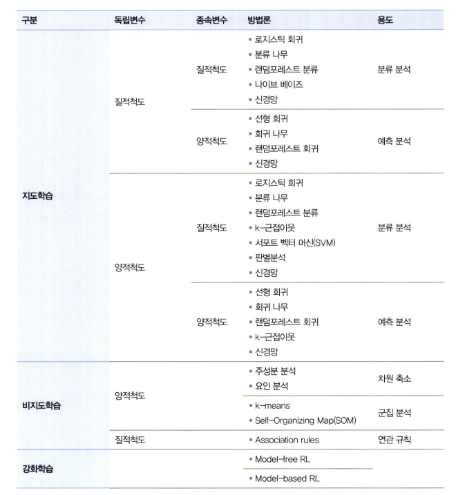
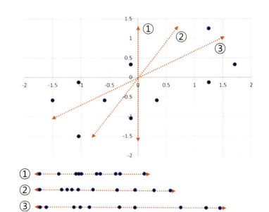

# 통계학 6주차 정규과제

📌통계학 정규과제는 매주 정해진 분량의 『*데이터 분석가가 반드시 알아야 할 모든 것*』 을 읽고 학습하는 것입니다. 이번 주는 아래의 **Statistics_6th_TIL**에 나열된 분량을 읽고 `학습 목표`에 맞게 공부하시면 됩니다.

아래의 문제를 풀어보며 학습 내용을 점검하세요. 문제를 해결하는 과정에서 개념을 스스로 정리하고, 필요한 경우 추가자료와 교재를 다시 참고하여 보완하는 것이 좋습니다.

6주차는 `3부. 데이터 분석하기`를 읽고 새롭게 배운 내용을 정리해주시면 됩니다.


## Statistics_6th_TIL

### 3부. 데이터 분석하기
### 12.통계 기반 분석 방법론


## Study Schedule

|주차 | 공부 범위     | 완료 여부 |
|----|----------------|----------|
|1주차| 1부 p.2~56     | ✅      |
|2주차| 1부 p.57~79    | ✅      | 
|3주차| 2부 p.82~120   | ✅      | 
|4주차| 2부 p.121~202  | ✅      | 
|5주차| 2부 p.203~254  | ✅      | 
|6주차| 3부 p.300~356  | ✅      | 
|7주차| 3부 p.357~615  | 🍽️      |

<!-- 여기까진 그대로 둬 주세요-->

# 12.통계 기반 분석 방법론

```
✅ 학습 목표 :
* 주성분 분석(PCA)의 개념을 설명할 수 있다.
* 다중공선성을 진단할 수 있다.
* Z-TEST와 T-TEST의 개념을 비교하고, 적절한 상황에서 검정을 설계하고 수행할 수 있다.
* ANOVA TEST를 활용하여 세 개 이상의 그룹 간 평균 차이를 검정하고, 사후검정을 수행할 수 있다.
* 카이제곱 검정을 통해 범주형 변수 간의 독립성과 연관성을 분석하는 방법을 설명할 수 있다.
```

## 12.1. 분석 모델 개요
<!-- 새롭게 배운 내용을 자유롭게 정리해주세요.-->
- 주요 데이터 분석 방법론
    - 통계 모델 : 모형과 해석, 오차의 불확정성 강조
    - 기계 학습 : 대용량 데이터를 활용해 예측의 정확도를 높이는 것 중요하게 생각함

- 최근에 머신러닝에 대한 관심이 높아졌지만, 머신러닝도 통계 모델 기반을 함께 활용할 때 높은 성과를 얻어냄




- 지도 학습/ 비지도 학습
    - 지도 학습: 정답이 주어져서 출력된 결괏값과 정답 사이의 오차가 줄어들도록 학습과 모델 수정 반복
        - 결괏값이 양적 척도면 회귀 방식
        - 질적 척도면 분류 방식
    - 비지도 학습 (자율 학습): 별도의 정답 없이 변수 간의 패턴을 파악하거나 데이터를 군집화하는 방법
        - 차원 축소, 군집 분석, 연관 규칙

## 12.2. 주성분 분석(PCA)
<!-- 새롭게 배운 내용을 자유롭게 정리해주세요.-->
- 주성분 분석(PCA)
    - 여러 개의 독립변수들을 잘 설명해줄 수 있는 주된 성분을 추출하는 기법 -> 결론적으로 독립변수(차원)의 수를 줄여서 차원의 저주 방지
    - 전제 조건
        - 사용되는 변수들이 all 등간 척도 or 비율척도로 측정한 양적변수
        - 관측치들이 서로 독립적이고 정규분포를 이루고 있어야함

    - 방법
        1. 변수 선택 -> 비교적 불필요하거나 유의성 낮은 변수를 제거
        2. 변수들의 잠재적인 성분을 추출해 차원 줄이기

    - 핵심 : 데이터 공간에 위치하는 **점들의 분산을 최대한 보존**하는 축을 통해 저차원으로 축소 
        - 물론 PCA 과정에서는 처음 가지고 있던 변수의 개수만큼 새로운 성분변수가 생김 -> BUT 전체 변수를 통합적으로 가장 잘 설명해주는 성분변수, 그 다음으로 높은 설명력 변수... 식으로 주성분 변수가 생성되므로 설명력 높은 애들만 남겨둘 수 있음<br/>
        일반적으로 [제1주성분], [제2주성분] 2개 정도로 선정

    - 과정
        - 목표:  데이터 분산을 가장 잘 표현할 수 있는 **저차원** 찾기 
        1. X1, X2 두 변수가 존재
        2. 데이터 표준화
        3. 가장 많은 분산을 담아낼 수 있는 최적의 축 찾기<br/>
            (곧, 주성분의 설명력 = 전체 분산 中 해당 주성분이 갖고 있는 분산)
        

## 12.4. 다중공선성 해결과 섀플리 밸류 분석
<!-- 새롭게 배운 내용을 자유롭게 정리해주세요.-->
- 다중공선성
    - 독립변수들 간의 상관관계가 높은 현상
    - 즉, 두 개 이상의 독립변수가 서로 선형적인 관계를 나타낼 때 -> 독립 변수들 간에는 서로 독립이라는 전제 가정을 위반함

    - 추정치의 통계적 유의성이 낮아서 모델의 정합성이 맞지 않는 문제가 생김 !! 
        - 회귀모델은 첫번째 독립 변수가 종속변수를 예측하고 두 번째 독립 변수가 남은 변량을 예측하는 식
        - but 다중공선성 발생 -> 두 변수가 설명할 수 있는 부분이 거의 동일하므로 첫 번째 변수가 설명하고 남은 변량을 두 번째 변수가 예측하는 데 문제가 생김.

    - 판별 기준
        1. 회귀 분석 모델 실행 전, 상관분석 -> 독립 변수 간의 상관성 확인 -> 높은 상관계수를 갖는 독립변수 찾아내기
        - 단점: 변수가 많을 경우 상관성 파악 어려움
        2. 결정계수 R제곱 값은 크지만 회귀계수에 대한 t값이 낮다면 의심해보기..
        - 종속변수에 대한 독립변수들의 설명력은 높은데 각 계수 추정치의 표준오차가 크다는건 독립변수 간 상관성이 크다는 의미이므로.... 
        3. VIF(분산팽창계수)
        - 모델에 사용된 다른 독립 변수들이 해당 변수 대신 모델을 설명해줄 수 있는 정도
        - VIF가 크다 = 해당 변수가 다른 변수들과 상관성이 높다 = 회귀 계수에 대한 분산을 증가시킨다 = 제거 ㄱ


## 12.6. Z-test와 T-test
<!-- 새롭게 배운 내용을 자유롭게 정리해주세요.-->
- 집단 내 혹은 집단 간의 평균값 차이가 통계적으로 유의미한지 알아내는 방법

- Z-test, T-test
    - 단일 표본 집단의 평균 변화를 분석 or 두 집단의 평균값 혹은 비율 차이 분석
    - 분석하고자 하는 변수 : **양적 변수, 정규 분포, 등분산** << 중요!!
    - 등분산(equal variance t-test 수행)이 아니면 이분산이므로 -> Welch's t-test 수행

    - 둘 중에 뭘 선택해야됨??
        - Z-test: 모집단의 분산을 알 수 있는 경우, but 그런 경우는 거의 없으므로 표본 크기 30 이상이면 중심 극한 정리에 의해 사용 ㄱㄴ
        - T-test: 표본 크기 30 미만이어서 표본 집단의 정규분포를 가정할 수 없을 때 사용, 물론 30 이상이여도 사용 가능함

## 12.7. ANOVA
<!-- 새롭게 배운 내용을 자유롭게 정리해주세요.-->
- **세 집단 이상의** 평균 차이를 검정하는 방법
- F분포를 사용함
    - 연속확률분포, 두 모분산의 비교 및 검정을 위해 사용
    - 항상 양의 값을 가지며 오른쪽으로 긴 꼬리 형태
    - ANOVA/회귀분석은 F분포로 독립변수가 종속변수에 미치는 영향 분석함

- 종류 (독립변수 요인 수에 따라 달라짐)
    - 일원 분산분석 (EX. 고객들의 객단가 평균 차이를 비교하기 위한 요인이 '지역' 1개일 경우)
    - 이원 분산분석 (EX. 위와 같은 경우인데, 요인이 '지역', '연령대' 2개일 경우)

- 독립변수는 집단을 나타낼 수 있는 범주형 변수, 종속 변수는 연속형 변수여야 함

- 각 집단의 평균값 차이가 통계적으로 유의한지 검증
    - 다시 말해 각 집단의 평균이 서로 멀리 떨어져 있어 집단 평균의 본산이 큰 정도를 따져서 집단 간 평균이 다른지 판별
    - 위를 측정하기 위해 집단 내의 각 관측치들이 집단 평균으로부터 얼마나 퍼져 있는지 나타내는 분산 **집단 내 분산**과 전체 집단의 통합 평균과 각 집단의 평균값이 얼마나 퍼져있는지 나타내는 **집단 간 평균** 사용


## 12.8. 카이제곱 검정(교차분석)
<!-- 새롭게 배운 내용을 자유롭게 정리해주세요.-->
- 명목 혹은 서열척도와 같은 범주형 변수들 간의 연관성 분석을 위한 방법

- 원리
    - 변수들 간의 범주를 동시에 교차하는 교차표 만듬 -> 각각의 빈도와 비율 측정 -> 변수 상호 간의 독립성과 관련성 분석

- 상관분석과는 달리 연관성의 정도를 수치로 표현 XXX
    - 대신, 검정 통계량 카이 제곱을 통해 변수 간에 연관성이 없다는 귀무가설을 기각하는지 여부로 상관성 O,X 판단


<br>
<br>

# 확인 문제

### **문제 1.**
> **🧚 경희는 다트비 교육 연구소의 연구원이다. 경희는 이번에 새롭게 개발한 교육 프로그램이 기존 프로그램보다 학습 성취도 향상에 효과적인지 검증하고자 100명의 학생을 무작위로 두 그룹으로 나누어 한 그룹(A)은 새로운 교육 프로그램을, 다른 그룹(B)은 기존 교육 프로그램을 수강하도록 하였다. 실험을 시작하기 전, 두 그룹(A, B)의 초기 시험 점수 평균을 비교한 결과, 유의미한 차이가 없었다. 8주 후, 학생들의 최종 시험 점수를 수집하여 두 그룹 간 평균 점수를 비교하려고 한다.**   

> **🔍 Q1. 이 실험에서 사용할 적절한 검정 방법은 무엇인가요?**

```
독립표본 t-검정
두 개의 독립적인 집단 간의 평균 차이를 비교하는 실험이므로
```

> **🔍 Q2. 이 실험에서 설정해야 할 귀무가설과 대립가설을 각각 작성하세요.**

```
귀무가설: 두 교육 프로그램 간 학습 성취도 평균 차이가 없다.
대립가설: 두 교육 프로그램 간 학습 성취도 평균 차이가 있다.
```

> **🔍 Q3. 검정을 수행하기 위한 절차를 순서대로 서술하세요.**

<!--P.337의 실습 코드 흐름을 확인하여 데이터를 불러온 후부터 어떤 절차로 검정을 수행해야 하는지 고민해보세요.-->

```
1. 두 그룹(A, B)의 최종 시험 점수 데이터를 수집한다.
2. 각 그룹의 평균, 표준편차, 분산 등을 확인한다.
3. 정규성 가정 검토 (Shapiro-Wilk 검정 사용)
4. 등분산성 가정 검토 (Levene의 등분산 검정)
5. 독립표본 t-검정을 수행 (등분산 여부에 따라 등분산 혹은 비등분산 t-검정 선택)한다.
6. 유의수준(보통 α=0.05)과 p-value를 비교하여 귀무가설 기각 여부를 결정한다.
7. 결과를 해석하고 도출한다.
```

> **🔍 Q4. 이 검정을 수행할 때 가정해야 하는 통계적 조건을 설명하세요.**

```
1. 두 집단은 서로 독립적이어야 한다.
2. 각 집단의 종속변수(시험 점수)는 정규 분포를 따른다고 가정한다. -> 정규성 가정
3. 두 집단의 분산은 같다고 가정한다. -> 등분산 가정
*여기서 Welch's t-test 사용 시 등분산 가정은 필요 없음!
```

> **🔍 Q5. 추가적으로 최신 AI 기반 교육 프로그램(C)도 도입하여 기존 프로그램(B) 및 새로운 프로그램(A)과 비교하여 성취도 차이가 있는지 평가하고자 한다면 어떤 검정 방법을 사용해야 하나요? 단, 실험을 시작하기 전, C 그룹의 초기 점수 평균도 A, B 그룹과 유의미한 차이가 없었다고 가정한다.**

```
일원분산분석
세 개 이상의 독립된 집단 A,B,C 평균을 비교하니까
```

> **🔍 Q6. 5번에서 답한 검정을 수행한 결과, 유의미한 차이가 나타났다면 추가적으로 어떤 검정을 수행해 볼 수 있을까요?**

```
사후 분석?
ANOVA는 세 그룹 간 평균 차이 유무만 알 수 있으므로 어떤 그룹 간에 차이가 있는지 확인하려면 사후 검정이 필요함
```

---

### **문제 2. 카이제곱 검정**  
> **🧚 다음 중 어떠한 경우에 카이제곱 검정을 사용해야 하나요?   
1️⃣ 제품 A, B, C의 평균 매출 차이를 비교하고자 한다.  
2️⃣ 남성과 여성의 신체 건강 점수 평균 차이를 분석한다.  
3️⃣ 제품 구매 여부(구매/미구매)와 고객의 연령대(10대, 20대, 30대…) 간의 연관성을 분석한다.  
4️⃣ 특정 치료법이 환자의 혈압을 감소시키는 효과가 있는지 확인한다.**  

```
3번
두 범주형 변수 간 독립성 또는 관련성을 분석할 땐 카이제곱 검정 사용함
```

### 🎉 수고하셨습니다.