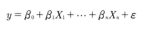
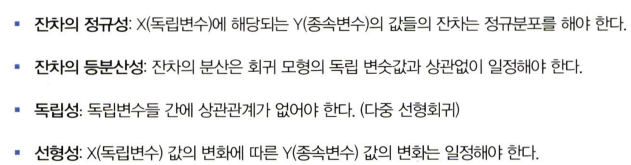
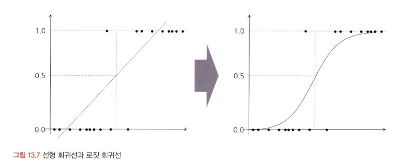

# 통계학 7주차 정규과제

📌통계학 정규과제는 매주 정해진 분량의 『*데이터 분석가가 반드시 알아야 할 모든 것*』 을 읽고 학습하는 것입니다. 이번 주는 아래의 **Statistics_7th_TIL**에 나열된 분량을 읽고 `학습 목표`에 맞게 공부하시면 됩니다.

아래의 문제를 풀어보며 학습 내용을 점검하세요. 문제를 해결하는 과정에서 개념을 스스로 정리하고, 필요한 경우 추가자료와 교재를 다시 참고하여 보완하는 것이 좋습니다.

7주차는 `3부. 데이터 분석하기`를 읽고 새롭게 배운 내용을 정리해주시면 됩니다.


## Statistics_7th_TIL

### 3부. 데이터 분석하기
### 13.머신러닝 분석 방법론
### 14.모델 평가


## Study Schedule

|주차 | 공부 범위     | 완료 여부 |
|----|----------------|----------|
|1주차| 1부 p.2~56     | ✅      |
|2주차| 1부 p.57~79    | ✅      | 
|3주차| 2부 p.82~120   | ✅      | 
|4주차| 2부 p.121~202  | ✅      | 
|5주차| 2부 p.203~254  | ✅      | 
|6주차| 3부 p.300~356  | ✅      | 
|7주차| 3부 p.357~615  | ✅      | 

<!-- 여기까진 그대로 둬 주세요-->

# 13.머신러닝 분석 방법론

```
✅ 학습 목표 :
* 선형 회귀와 다항 회귀를 비교하고, 데이터를 활용하여 적절한 회귀 모델을 구축할 수 있다. 
* 로지스틱 회귀 분석의 개념과 오즈(Odds)의 의미를 설명하고, 분류 문제에 적용할 수 있다.
* k-means 알고리즘의 원리를 설명하고, 적절한 군집 개수를 결정하여 데이터를 군집화할 수 있다.
```

## 13.1. 선형 회귀분석과 Elastic Net(예측모델)
<!-- 새롭게 배운 내용을 자유롭게 정리해주세요.-->
<!-- `13.1.3. Ridge와 Lasso 그리고 Elastic Net` 부분은 제외하고 학습하셔도 무방합니다.-->
### 회귀분석
- 종속변수 Y의 값에 영향을 주는 독립변수 X들의 조건을 고려하여 구한 평균값
- BUT 직선이기 때문에 오차 생길 수 있음 -> 오차를 최소화하기 위해 '회귀선' 등장
    - 회귀선 : 절편, 기울기, 오차항으로 이루어짐
    - 오차항을 최소화하는 절편과 기울기를 구하는 것 = 회귀분석
    
    <br/>
    ㄴ y는 예측하고자 하는 값, 베타0은 절편, 베타1부터 베타n은 각 독립변수가 종속변수에 주는 영향력(계수)값
    - 그래서 최적의 회귀선이 뭔데..?
        - 회귀선과 각 관측치를 뜻하는 점 간의 거리를 최소화하는 선으로, 예측치와 관측치들 간의 수직 거리(오차)의 제곱합을 최소로 하는 직선

- 독립변수가 두 개 이상 = 다중 회귀 분석
    - 독립변수 간 상관관계가 없어야하므로 다중 회귀 분석 시 **다중공선성 검사**가 중요!
        - 상관분석, VIF값 확인 등을 통해 확인
        

- 비선형관계를 회귀분석..?
    - 회귀선이 선형이므로, 독립변수와 종속변수가 비선형적 관계일 경우 예측력이 떨어지는 문제 발생
    - 비선형 관계를 회귀분석하려면 -> 변수를 구간화해 이항변수로 표시된 몇 개의 더미변수로 변환해 분석 <br/>
    or
    - 독립변수나 종속변수에 로그함수를 이용하여 치환

### 다항 회귀
- 독립변수들과 종속변수의 관계가 직선이 아닌 곡선의 관계를 가진 경우의 일반 회귀모델 변수 가공 방식은 한계가 있음
- 그래서 독립변수와 종속변수의 관계가 곡선형 관계일 때 변수에 각 특성의 제곱을 추가해 회귀선을 곡선형으로 변환하는 모델 만듬
    - 단, 차수가 커질수록 편향은 감소하지만 변동성이 증가
    - 그래서 분산이 늘어나고 과적합 유발 가능


## 13.2. 로지스틱 회귀분석 (분류모델)
<!-- 새롭게 배운 내용을 자유롭게 정리해주세요.-->
- 선형회귀분석과 유사하지만 종속변수가 양적척도가 아닌 질적척도라는 차이가 있음
- 즉, 특정 수치를 예측하는 것 x, 어떤 카테고리에 들어갈지 분류하는 모델 -> 기본 모형은 종속변수가 0과 1 (이항, binary)
    - 만약 종속변수 범주가 3개 이상이라면 다항 로지스틱 회귀분석 

- 기존 선형회귀식 아이디어 + 종속변수를 1이 될 확률로 변환해 그 확률에 따라 0과 1 여부를 예측하는 방법 (값이 0.5보다 크면 1, 작으면 0으로 분류)

- 선형 회귀선은 이항으로 이루어진 종속변수를 직선으로 표현하려다 보니 확률이 양과 음의 무한대로 뻗어나감 -> 문제 발생
- 따라서 오른쪽 형태 같이 0과 1 사이의 S자 곡선의 형태를 갖도록 변환시켜줘야 함
    - 이 때 '오즈값'을 구해야함
        - 오즈: 사건이 발생할 가능성이 발생하지 않을 가능성보다 어느 정도 큰지 나타내는 값

## 13.8. k-means 클러스터링(군집모델)
<!-- 새롭게 배운 내용을 자유롭게 정리해주세요.-->
- KNN VS K-means 클러스터링
    - KNN은 지도 학습
    - K-means 클러스터링은 비지도학습

- K-means 클러스터링
    - 군집화 알고리즘 중 구현 방법이 매우 간단하고 실행 속도 빠름
    - k = 분류할 군집의 수, Means = 각 군집의 중심(Centroid)
    


# 14. 모델 평가

```
✅ 학습 목표 :
* 유의확률(p-value)을 해석할 때 주의할 점을 설명할 수 있다.
* 분석가가 올바른 주관적 판단을 위한 필수 요소를 식별할 수 있다.
```

## 14.3. 회귀성능 평가지표
<!-- 새롭게 배운 내용을 자유롭게 정리해주세요.-->

## 14.6. 유의확률의 함정
<!-- 새롭게 배운 내용을 자유롭게 정리해주세요.-->

## 14.7. 분석가의 주관적 판단과 스토리텔링
<!-- 새롭게 배운 내용을 자유롭게 정리해주세요.-->


<br>
<br>

# 확인 문제

## **문제 1. 선형 회귀**

> **🧚 칼 피어슨의 아버지와 아들의 키 연구 결과를 바탕으로, 다음 선형 회귀식을 해석하세요.**  
> 칼 피어슨(Karl Pearson)은 아버지(X)와 아들(Y)의 키를 조사한 결과를 바탕으로 아래와 같은 선형 회귀식을 도출하였습니다. 아래의 선형 회귀식을 보고 기울기의 의미를 설명하세요. 
>  
> **ŷ = 33.73 + 0.516X**  
>   
> - **X**: 아버지의 키 (cm)  
> - **ŷ**: 아들의 예상 키 (cm)  

```
여기에 답을 작성해주세요!
```
---

## **문제 2. 로지스틱 회귀**  

> **🧚 다트비에서는 학생의 학업 성취도를 예측하기 위해 다항 로지스틱 회귀 분석을 수행하였습니다. 학업 성취도(Y)는 ‘낮음’, ‘보통’, ‘높음’ 3가지 범주로 구분되며, 독립 변수는 주당 공부 시간(Study Hours)과 출석률(Attendance Rate)입니다. 단, 기준범주는 '낮음' 입니다.**   

| 변수 | Odds Ratio Estimates | 95% Wald Confidence Limits |  
|------|----------------------|--------------------------|  
| Study Hours | **2.34** | (1.89, 2.88) |  
| Attendance Rate | **3.87** | (2.92, 5.13) |  

> 🔍 Q1. Odds Ratio Estimates(오즈비, OR)의 의미를 해석하세요.

<!--변수 Study Hours의 오즈비 값이 2.34라는 것과 Attendance Rate의 오즈비 값이 3.87이라는 것이 각각 무엇을 의미하는지 구체적으로 생각해보세요.-->

```
여기에 답을 작성해주세요!
```

> 🔍 Q2. 95% Wald Confidence Limits의 의미를 설명하세요.
<!--각 변수의 신뢰구간에 제시된 수치가 의미하는 바를 생각해보세요.-->

```
여기에 답을 작성해주세요!
```

> 🔍 Q3. 이 분석을 기반으로 학업 성취도를 향상시키기 위한 전략을 제안하세요.
<!--Study Hours와 Attendance Rate 중 어느 변수가 학업 성취도에 더 큰 영향을 미치는지를 고려하여, 학업 성취도를 향상시키기 위한 효과적인 전략을 구체적으로 제시해보세요.-->

```
여기에 답을 작성해주세요!
```

---


## **문제 3. k-means 클러스터링**

> **🧚 선교는 고객을 유사한 그룹으로 분류하기 위해 k-means 클러스터링을 적용했습니다. 초기에는 3개의 군집으로 설정했지만, 결과가 만족스럽지 않았습니다. 선교가 최적의 군집 수를 찾기 위해 사용할 수 있는 방법을 한 가지 이상 제시하고 설명하세요.**

```
여기에 답을 작성해주세요!
```

### 🎉 수고하셨습니다.